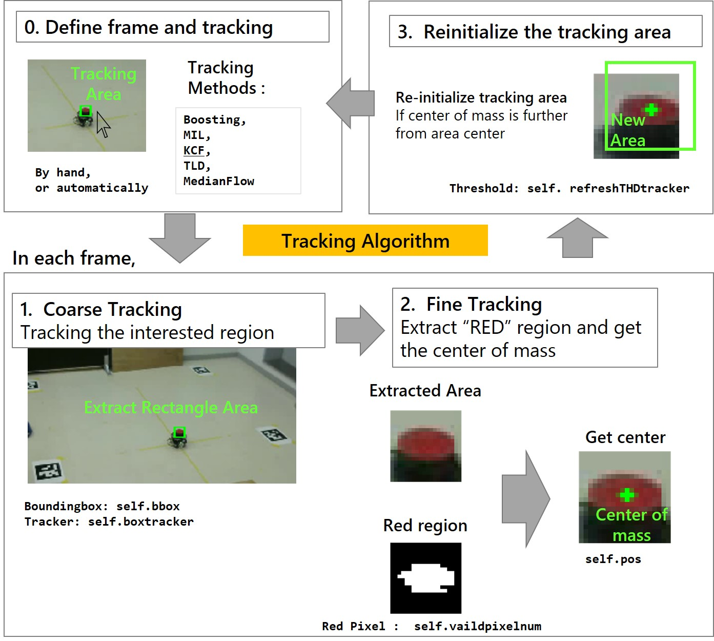

# IVPS
Indoor Vision based Positioning System (Under Construction)

# Setting

## Requirement

- Assuming ROS Kinetic Environment on Ubuntu
- Python2.7 with OpenCV3.X with Opencv-contrib package

To install opencv with contrib package, type

```
pip install opencv-contrib-python
```

## Usage

```python
import cv2
import numpy as np
import sys
import math

sys.path.append("../")

from vmarker import *
```


# Program Flow

## Detect Camera Pose

- Put marker on the ground and write its coordinate to csv file
- Camera pose is solved from PNP solver


## Tracking the Interested Region

- `RedTracker.py` provide the tracking algorithm



## Give Marker Height and Get 3D Position

- Given the **height of the tracking point**, Marker position is solved via homogeneous linear equations

